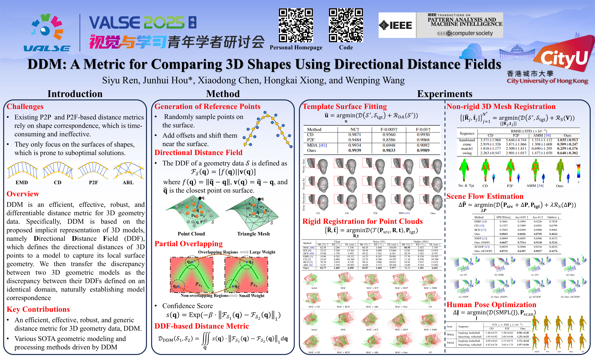

## DDM: A Metric for Comparing 3D Shapes Using Directional Distance Fields (T-PAMI 2025)

[[Arxiv]](https://arxiv.org/abs/2401.09736) [[T-PAMI]](https://ieeexplore.ieee.org/abstract/document/10964075)



## Installation

```
cd DDM
python set_up.py install
```

## Usage
**Note: When using DDM, the setting regularization weights is also important, and it will range from 0.01 to 10000 !!!**    
Here we provide three versions of DDM, i.e., Point-to-Point, Mesh-to-Mesh, and Mesh-to-Point (in the paper, it is face).    


###### Optimize a point cloud according to the reference point cloud

```
from Closest_Point_on_Surface import DDM_P2P

loss_func=DDM_P2P()

......
loss=loss_func(src_points,tgt_points)
......
```

###### Optimize a triangle mesh according to the reference triangle mesh

```
from Closest_Point_on_Surface import DDM_M2M

loss_func=DDM_M2M()

......
loss=loss_func(src_v,src_f,tgt_v,tgt_f)
......
```

###### Optimize a triangle mesh according to the reference point cloud

```
from Closest_Point_on_Surface import DDM_M2P

loss_func=DDM_M2P()

......
loss=loss_func(src_v,src_f,tgt_points)
......
```

## TODO

* [X] Release code.
* [ ] Release examples on the selected applications
  * [ ] Shape Deformation
  * [X] Rigid Registration
  * [X] Non-rigid Registration
  * [ ] Scene Flow Estimation
  * [ ] Human Pose Optimization

## Acknowledgement

We thank the following excellent works including MAC, AMM, NSFP, SCOOP, and MDA for their released codes.

## Citation
```bibtex
@article{ren2024measuring,
  title={DDM:  A Metric for Comparing 3D Shapes Using Directional Distance Fields},
  author={Ren, Siyu and Hou, Junhui and Chen, Xiaodong and Xiong, Hongkai and Wang, Wenping},
  journal={IEEE Transactions on Pattern Analysis and Machine Intelligence},
  year={2025}
}
```
